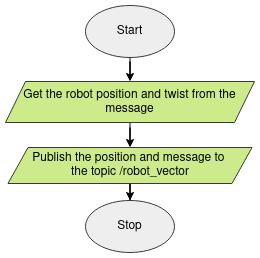

Research Track 1 - Assignment 2 Solution
================================
The following repository contains the solution to the second assignment for the Research Track 1 Course, found in the Robotics Masters Programme at the University of Genoa, Italy. Within the linked repository are a series of python scripts that implement ROS nodes which interact with a predefined ROS package running a test environment on the gazebo simulator. Utilizing these nodes, a user can control the robot behaviour by: specifying a goal position the robot should move towards, stopping robot movement by cancelling a specified goal as well as be able to monitor certain semantic data of the robot.
<br><br>

Table of Contents
----------------------
1. [Prerequisites](https://github.com/Markie3110/Research_Track_1-Assignment_2/tree/main?tab=readme-ov-file#prerequisites)
2. [Project Contents](https://github.com/Markie3110/Research_Track_1-Assignment_2/tree/main?tab=readme-ov-file#project-contents)
3. [How to Install](https://github.com/Markie3110/Research_Track_1-Assignment_2/tree/main?tab=readme-ov-file#how-to-install)
4. [How to run](https://github.com/Markie3110/Research_Track_1-Assignment_2/tree/main?tab=readme-ov-file#how-to-run)
5. [Code Flowcharts](https://github.com/Markie3110/Research_Track_1-Assignment_2/tree/main?tab=readme-ov-file#code-flowcharts)
<br>

Prerequisites
----------------------
In order to be able to run the simulator, the "assignment_2_2023" ROS package is needed. The package can be installed from the following Github repository: *https://github.com/CarmineD8/assignment_2_2023*.
<br><br>

Project Contents
----------------------
The project has three elementary python scripts of interest, each of which implement a ROS node with a specific functionality.

1. user_interface_py.py<br>
Implements the node "UI", that utilizes an actionclient subscribed to the actionserver "/reaching_goal" to create a user interface that allows the user to send and preempt robot goals. This node also publishes the robots position and twist to a custom topic "/robot_vector", that is utilized by the "average" node (explained below).

2. last_target_py.py<br>
The ROS node "last_target" that implements the rosservice "last_target_serv" which when called, prints the latest goal position specified by the user. Obtains the latest goal via a subscription to the "/goal" topic of the "reaching_goal" actionserver.

3. average_py.py<br>
The ROS node "average" that implements another rosservice "average_serv" which when called, returns the robots average speed and distance from the target. Utilizes the data published by the node "UI" on the topic "/robot_vector" to carry out the computations.
<br>

How to Install
----------------------
To download the repsitory's contents to your local system you can do one of the following:

1. Using git from your local system<br>
To download the repo using git simply go to your terminal and go to the src directory within your ROS workspace. Type the following command to clone the repository to your folder:
```bash
$ git clone "https://github.com/Markie3110/Research_Track_1-Assignment_2.git"
```

2. Download the .zip from Github<br>
In a browser go to the repository on Github and download the .zip file availabe in the code dropdown box found at the top right. Unzip the file to access the contents.
<br>

How to Run
----------------------
To run the nodes carry out the following steps:<br>
1. In the command line of the terminal, run the rosmaster via the following command:
```bash
roscore
```
2. To run the simulator, open another window of the terminal and execute the following command:
```bash
roslaunch assignment_2_sol assignment2.launch
```
3. To call the rosservices last_target_serv and average_serv, enter the following ros calls in a seperate third terminal to view the results:<br>
```bash
rosservice call last_target_serv
```
```bash
rosservice call average_serv
```
<br>

Code Flowcharts
----------------------
The flowcharts describing the program flow of the various functions found in the "UI" node are given below:


### main ###
The main function that is run when the python script is executed. Create the ROS node, and calls a UIClient class that handles the actionclient behaviour. Also subscribes to the topic "/odom" to get the latest robot position and twist.
<p align="center">
  
</p>
<br>
<br>


### __init__ ###
The first function that is executed when the UIClient class is called. 
<p align="center">
  
</p>
<br>
<br>


### feedback_cb ###
A callback that executes whenever the client receives a feedback message from the server.
<p align="center">
  
</p>
<br>
<br>

### done_cb ###
A callback that executes whenever the client receives a done message from the server.
<p align="center">
  
</p>
<br>
<br>

### odom_callback ###
A callback to the subscriber for "/odom" that executes whenever the node receives new data.
<p align="center">
  
</p>
<br>
<br>

